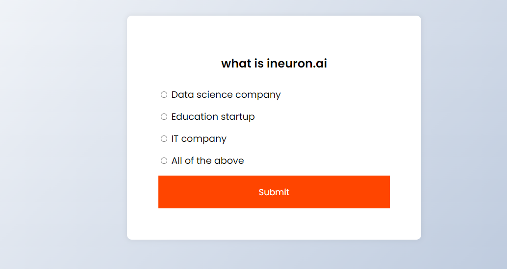

# Live(Netlify)

## screenshot

# JavaScript Quizz-App

# Build with-

# Acknowledgments
List of resources i find helpful and i would like to give credit to-
1. shields.io       
2. forthebadge   

# Contributing
Contributions are what make the open source community such an amazing place to learn, inspire, and create. Any contributions you make are greatly appreciated.

If you have a suggestion that would make this better, please fork the repo and create a pull request. You can also simply open an issue with the tag "enhancement". Don't forget to give the project a star! Thanks again!

1. Fork the Project
2. Create your Feature Branch (git checkout -b feature/AmazingFeature)
3. Commit your Changes (git commit -m 'Add some AmazingFeature')
4. Push to the Branch (git push origin feature/AmazingFeature)
5. Open a Pull Request

